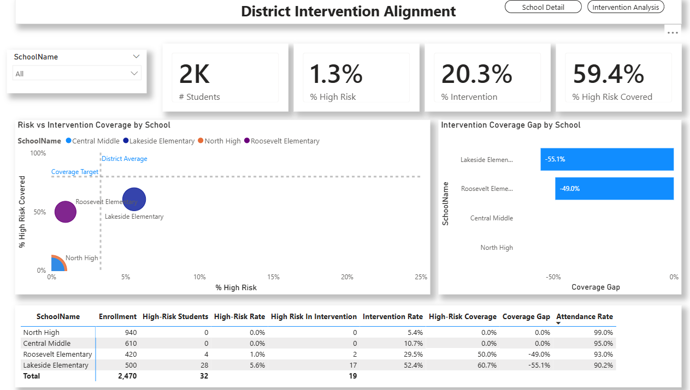
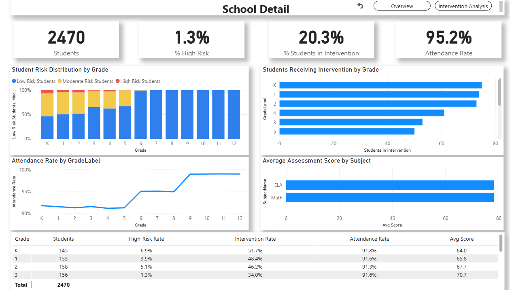
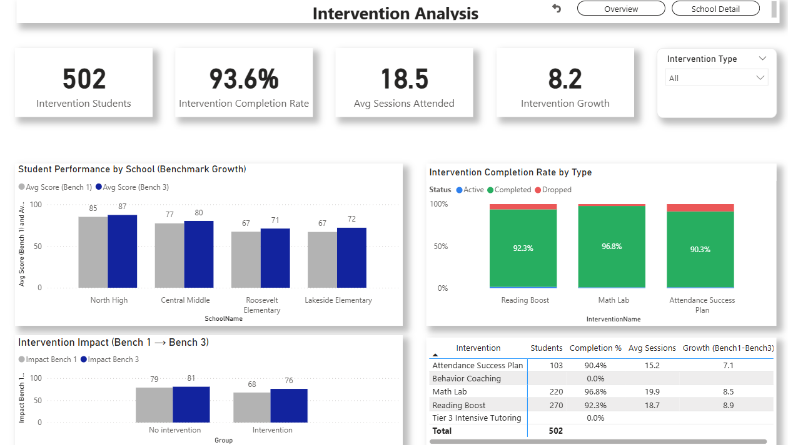
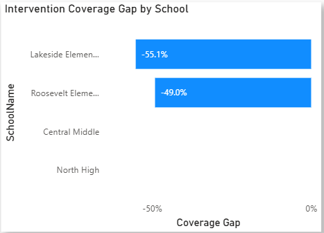
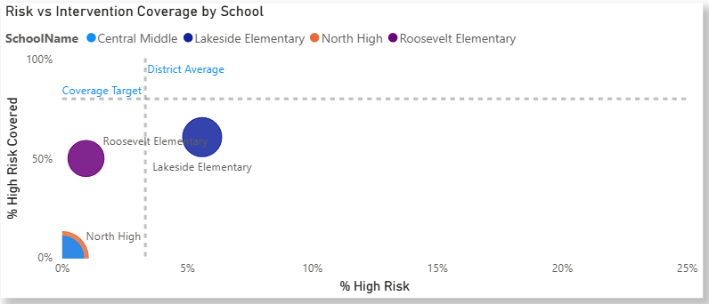

# Education Intervention Effectiveness Dashboard (Power BI + SQL)

## Overview

This project analyzes student risk, intervention participation, and academic outcomes across multiple schools.

**Key question:** Are intervention programs effectively improving student performance?

The dashboard connects:
- Risk (who needs support)
- Intervention (who is receiving support)
- Outcomes (are students improving over time)

---

## Dashboard Preview

### Overview Page

 

### School Detail Page

 

### Intervention Analysis Page

---
## Key Insights (Visual Walkthrough)

### Intervention Coverage Alignment

All schools demonstrate negative or neutral coverage gaps, meaning intervention support meets or exceeds identified student risk. Larger negative gaps suggest that some schools are extending support beyond strictly high-risk students, reflecting a proactive or preventative approach while also presenting an opportunity to evaluate resource targeting.

---

### Intervention Effectiveness

Despite starting at a lower baseline, students in intervention programs show substantially higher growth between Bench 1 and Bench 3 compared to non-intervention peers, demonstrating that interventions are effectively improving student outcomes.

---

### Risk vs Intervention Alignment

This view compares student risk levels to intervention coverage across schools. Variation in positioning highlights how well each school aligns support with need, with some schools demonstrating stronger alignment while others indicate opportunities to better target intervention resources.
## Project Background

This project simulates an educational analytics environment focused on evaluating student performance and intervention effectiveness across multiple schools.

From a data analyst perspective, the objective is to:
- Identify at-risk students  
- Assess whether intervention programs are reaching the right populations  
- Determine whether those interventions are improving academic outcomes  

Key metrics analyzed include:
- High-Risk Rate  
- Intervention Rate  
- Attendance Rate  
- Academic Growth (Bench 1 → Bench 3)  

---

## Data Structure & Model

A relational data model was built using SQL Server, consisting of:

- **DimStudent** – student-level attributes  
- **DimSchool** – school-level information  
- **DimGrade** – grade structure  
- **DimIntervention** – intervention programs  
- **FactAssessment** – student performance scores (Bench 1 and Bench 3)  
- **FactInterventionParticipation** – intervention participation, status, and sessions attended  

The model supports filtering across schools, grades, and interventions while maintaining accurate aggregation and context-aware calculations.

---

## Executive Summary

### Overview of Findings

- Students receiving interventions start at a lower baseline but demonstrate significantly higher growth compared to non-intervention students  
- Some schools show gaps between at-risk populations and intervention coverage, indicating opportunities for improved resource alignment  
- Negative coverage gaps suggest certain schools are taking a proactive, preventative approach to student support  

---

## Key Concepts

### Benchmarks (Bench 1 vs Bench 3)

- **Bench 1** represents an earlier assessment (starting point)  
- **Bench 3** represents a later assessment (ending point)  

Growth is calculated as:

This allows measurement of student improvement over time.

---

### Intervention Coverage Gap

The coverage gap measures alignment between student need and support:

- Positive gap → underserved students  
- Near zero → strong alignment  
- Negative gap → proactive or broad intervention coverage  

---

## Insights Deep Dive

### 1. Risk Analysis

- Schools vary significantly in high-risk student percentages, indicating uneven distribution of academic need  
- Some schools maintain low risk levels, potentially reflecting stronger baseline performance or early intervention strategies  

---

### 2. Intervention Coverage

- Several schools exhibit positive coverage gaps, where not all high-risk students are receiving intervention support  
- Negative gaps indicate proactive intervention strategies, where support extends beyond strictly high-risk populations  

---

### 3. Intervention Effectiveness

- Intervention students show greater academic growth between Bench 1 and Bench 3 compared to non-intervention students  
- Growth trends suggest interventions are having a measurable positive impact on student outcomes  

---

### 4. School-Level Variability

- Performance, intervention rates, and outcomes vary significantly across schools  
- Grade-level analysis reveals that performance challenges are often concentrated in specific grade bands rather than evenly distributed  

---

## Recommendations

Based on the analysis, the following actions are recommended:

- Increase intervention coverage in schools with large positive coverage gaps to ensure at-risk students receive adequate support  
- Evaluate intervention targeting strategies in schools with negative gaps to ensure resources are efficiently allocated  
- Expand intervention programs that demonstrate strong growth outcomes  
- Monitor grade-level trends to apply targeted support where performance issues are concentrated  

---

## Features

- Multi-page dashboard with intuitive navigation  
- Drillthrough functionality for school-level analysis  
- Dynamic filtering using slicers  
- Context-aware DAX measures  
- Intervention vs non-intervention comparison logic  

---

## Project Structure

- Screenshots: dashboard visuals  
- SQL: data model and data generation scripts  
- Power BI: `.pbix` file  
- Docs: project explanation and notes  

---

## Assumptions and Caveats

- Data is simulated and designed to reflect realistic educational trends  
- Benchmark dates (Bench 1 and Bench 3) represent fixed assessment periods  
- Students may participate in multiple interventions, introducing some overlap in analysis  
- Intervention participation is assumed to remain consistent between benchmark periods  

---

## Purpose

This project demonstrates how data can be used to:

- Identify at-risk populations  
- Evaluate intervention effectiveness  
- Support data-driven decision-making  

It is designed as a portfolio project showcasing end-to-end analytics development, including data modeling, metric design, and insight generation.

---

## Author

Built as a portfolio project to demonstrate data analytics, business intelligence, and data storytelling skills.
